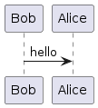
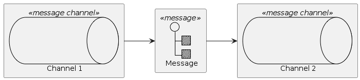
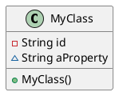
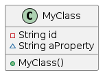

# ejemplo markdown

````plantuml
@startuml
Bob -> Alice:hello
@enduml
````



---

```plantuml
@startuml
!includeurl https://raw.githubusercontent.com/plantuml-stdlib/EIP-PlantUML/main/dist/EIP-PlantUML.puml

left to right direction

MsgChannel(channel1, "Channel 1")
MsgChannel(channel2, "Channel 2")
Message(msg, "Message")

Send(channel1, msg)
Send(msg, channel2)
@enduml
```



---

```java
public class MyClass {
    private final String id;
    protected String aProperty;
    public MyClass() {
    }
}
```





---

## plantuml - generar imágenes

* `mvn dependency:get -Dartifact=net.sourceforge.plantuml:plantuml:1.2022.12`

* `java -jar ~/.m2/repository/net/sourceforge/plantuml/plantuml/1.2022.12/plantuml-1.2022.12.jar README.md`

---

## marp - convertir markdown en presentación

* npx - `npx @marp-team/marp-cli@latest -w README.md` 

* docker - `docker run --rm -v $PWD:/home/marp/app/ -e LANG=$LANG -e MARP_USER="$(id -u):$(id -g)" marpteam/marp-cli -w README.md`

---

## TODO

* [ ] Integrar marp y plantuml

----
# <!-- fit --> :+1:
